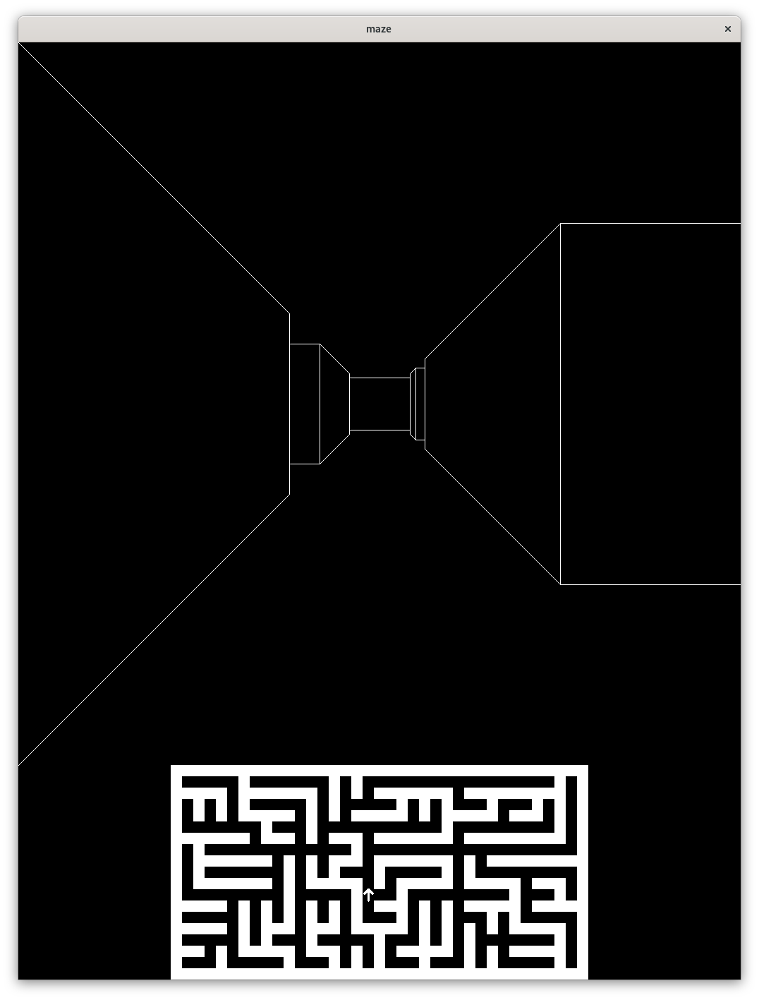

# Maze
ランダムに生成した迷路をの中を、[Maze War](https://en.wikipedia.org/wiki/Maze_(1973_video_game))風の一人称視点で歩き回ることの出来るシミュレーションです。歩き回ることが出来るだけでゲーム性はありません。多少は独自性のある機能をと思い、迷路内の任意の位置からゴール(右下)までの道順を自然言語で出力する機能を付けました。

## 必要環境
- Python3
- OpenCV

## インストール
例えば以下のようにして、このリポジトリの内容をディレクトリに展開し、そのディレクトリに移動して下さい。
```
git clone https://github.com/knakan213/maze.git
cd maze
```

## 使い方
> Linux or Mac
```
python3 maze.py
```
> Windows
```
python maze.py
```
とすると迷路がランダムに生成され、上部に大きく3D表示、下部に小さく2D表示されます。2D表示の中の矢印はプレイヤーの位置と向きを表わしており、開始時には迷路の一番左上のマスに右向きで置かれています。



### 操作方法
| キー  | 動作                                       |
|-------|--------------------------------------------|
| w     | 前方に進む                                 |
| s     | 後方に下る                                 |
| a     | 視点を左に90度回転する                     |
| d     | 視点を右に90度回転する                     |
| q     | シミュレーションを終了する                 |
| SPACE | ゴール(右下)までの道案内をする<sup>1</sup> |

<sup>1</sup> 現在位置からゴール(右下)までの道のりを日本語で標準出力に出力します。たとえば上記スクリーンショットの位置と向きであれば「`そのまま真っ直ぐ進み、2個目の交差点を右、2個目の交差点を右、突き当たりを左、1個目の交差点を右、突き当たりを左、突き当たりを右、と進むと突き当たりがゴールです。`」と出力されます。ここで交差点とは三叉路を含みます。

### コマンドラインオプション
以下の通り、コマンドラインオプションにより迷路のサイズや3D表示部の大きさ、迷路の生成アルゴリズムを指定することが出来ます。
```
usage: maze.py [-h] [--width WIDTH] [--height HEIGHT] [--vsize VSIZE] [--gen GEN]

options:
  -h, --help       show this help message and exit
  --width WIDTH    迷路の横幅(2以上) (既定値 18)
  --height HEIGHT  迷路の縦幅(2以上) (既定値 9)
  --vsize VSIZE    3D迷路表示部の一辺の長さ (既定値 1024)
  --gen GEN        迷路生成アルゴリズム(prim, dfs, kabe) (既定値 prim)
```
- 生成アルゴリズムにおいて迷路は正方形グリッドの各セルが上下左右のセルとの間に壁を持ったり持たなかったりするパターンとしてモデル化されており、上記オプションで指定する迷路のサイズもこの正方形グリッドの縦横のセル数のことですが、実際表示されるのはそれを壁にも空間セルと同じ厚みを持たせ各セル壁か空間かの二値グリッドとして表わしたものであり、迷路のサイズを横w、縦hと指定した場合、横2w+1、縦2h+1のグリッドになります。
- 生成アルゴリズムは`prim`を指定した場合[randomized Prim's](https://en.wikipedia.org/wiki/Maze_generation_algorithm#Iterative_randomized_Prim's_algorithm_(without_stack,_without_sets))、`dfs`を指定した場合[recursive backtracker](https://en.wikipedia.org/wiki/Maze_generation_algorithm#Randomized_depth-first_search)、`kabe`を指定した場合[壁伸ばし法](https://www.google.com/search?q=%E5%A3%81%E4%BC%B8%E3%81%B0%E3%81%97%E6%B3%95)になります。
- 2D表示部では各セルは一辺VSIZE÷64ドットの正方形で表示されます。
